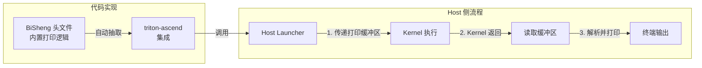

# 调试模块（DFX）

## 硬件背景

**device_print**：

device_print是Triton框架在昇腾NPU上提供的一个设备端调试工具，允许开发者在算子内核执行过程中直接打印标量/矢量信息，核心流程如下：



**关键硬件资源约束**：

- UB打印缓冲区：每个aicore固定分配16 KB空间用于数据暂存，且同一个aicore内的所有打印操作共享这16 KB缓冲区，写满后新数据提示warning，大小超过缓冲区最大值后丢弃。

- 多核并发：每个aicore独立执行内核代码，最终host侧呈现每个核的打印结果。

## 算法原理

实现原理涉及Triton Ascend、AscendNPU IR、毕昇编译器三部分配合，实现该功能主要以AscendNPU IR为重点展开说明。

### Triton Ascend

生成初始`.ttadapter` IR过程中会将triton侧的`tl.device_print`转换成`func.call @triton_print_*`接口。

### AscendNPU IR

接收到`.ttadapter` IR之后在AscendNPU IR阶段主要会经历如下变换：

#### AdaptTritonKernel

将`func.call @triton_print_*`接口转换成`hfusion.print`接口。

```mlir
// Before AdaptTritonKernel
%reinterpret_cast = memref.reinterpret_cast %arg2 to offset: [0], sizes: [8], strides: [1] : memref<?xi64> to memref<8xi64, strided<[1]>>
%alloc = memref.alloc() : memref<8xi64>
memref.copy %reinterpret_cast, %alloc : memref<8xi64, strided<[1]>> to memref<8xi64>
%0 = bufferization.to_tensor %alloc restrict writable : memref<8xi64>
call @triton_print_0(%0) : (tensor<8xi64>) -> ()

// After AdaptTritonKernel
%reinterpret_cast = memref.reinterpret_cast %arg2 to offset: [0], sizes: [8], strides: [1] : memref<?xi64> to memref<8xi64, strided<[1]>>
%alloc = memref.alloc() : memref<8xi64>
memref.copy %reinterpret_cast, %alloc : memref<8xi64, strided<[1]>> to memref<8xi64>
%0 = bufferization.to_tensor %alloc restrict writable : memref<8xi64>
hfusion.print " x: " {hex = false} %0 : tensor<8xi64>
```

#### HFusionToHIVM

将`hfusion.print`接口转换成`hivm.hir.debug`接口。

```mlir
// Before ConvertHFusionToHIVM
%reinterpret_cast = memref.reinterpret_cast %arg3 to offset: [0], sizes: [8], strides: [1] : memref<?xi64> to memref<8xi64, strided<[1]>>
%alloc = memref.alloc() : memref<8xi64>
memref.copy %reinterpret_cast, %alloc : memref<8xi64, strided<[1]>> to memref<8xi64>
%0 = bufferization.to_tensor %alloc restrict writable : memref<8xi64>
hfusion.print " x: " {hex = false} %0 : tensor<8xi64>

// After ConvertHFusionToHIVM
%reinterpret_cast = memref.reinterpret_cast %arg3 to offset: [0], sizes: [8], strides: [1] : memref<?xi64> to memref<8xi64, strided<[1]>>
%alloc = memref.alloc() : memref<8xi64>
memref.copy %reinterpret_cast, %alloc : memref<8xi64, strided<[1]>> to memref<8xi64>
%0 = bufferization.to_tensor %alloc restrict writable : memref<8xi64>
hivm.hir.debug {debugtype = "print", hex = false, prefix = " x: ", tcoretype = #hivm.tcore_type<CUBE_OR_VECTOR>} %0 : tensor<8xi64>
```

#### InlineFixpipe

插入fixpipe以用于`hivm.print`，该`hivm.print`会打印`mmad`结果，而`mmad`结果是`scf.for`中的`yield`。

```mlir
// Before InlineFixpipe
%init = tensor.empty()
%res = scf.for iter_arg(%arg = %init) {
    %t = hivm.mmadL1 ins() outs(%arg)
    hivm.print %t
    scf.yield %t
}

// After InlineFixpipe
%init = tensor.empty()
%res = scf.for iter_arg(%arg = %init) {
    %t = hivm.mmadL1 ins() outs(%arg)
    %fixpipe = hivm.fixpipe int(%t)
    hivm.print %fixpipe
    scf.yield %t
}
```

#### InsertNZ2NDForDebug

`device_print`仅支持UB/GM上的数据打印，因此当打印L1的数据时，需要将数据先从L1搬至GM。该Pass的作用就是：当识别到`hivm::MmadL1Op`时，检查该op的输入；若输入被`hivm::DebugOp`用到，则需要申请一块`workspace`的大小，然后插入`NZ2ND`的op，确保搬至GM打印。

```mlir
// Before InsertNZ2NDForDebug
%12 = bufferization.to_tensor %alloc restrict writable : memref<1x4xf32>
%13 = arith.index_cast %arg8 : i32 to index
%14 = arith.index_cast %5 : i32 to index
%reinterpret_cast_0 = memref.reinterpret_cast %arg4 to offset: [%14], sizes: [4, 1], strides: [%13, 1] : memref<?xf32> to memref<4x1xf32, strided<[?, 1], offset: ?>>
%alloc_1 = memref.alloc() : memref<4x1xf32>
hivm.hir.load ins(%reinterpret_cast_0 : memref<4x1xf32, strided<[?, 1], offset: ?>>) outs(%alloc_1 : memref<4x1xf32>) init_out_buffer = false may_implicit_transpose_with_last_axis = false
%15 = bufferization.to_tensor %alloc_1 restrict writable : memref<4x1xf32>
%16 = arith.muli %8, %arg8 : i32
%17 = arith.index_cast %16 : i32 to index
%18 = arith.addi %17, %14 : index
%19 = tensor.empty() : tensor<1x1xf32>
%c1 = arith.constant 1 : index
%c4 = arith.constant 4 : index
%c1_2 = arith.constant 1 : index
%20 = hivm.hir.mmadL1 {fixpipe_already_inserted = true} ins(%12, %15, %true, %c1, %c4, %c1_2 : tensor<1x4xf32>, tensor<4x1xf32>, i1, index, index, index) outs(%19 : tensor<1x1xf32>) -> tensor<1x1xf32>
hivm.hir.debug {debugtype = "print", hex = false, prefix = " a_vals: ", tcoretype = #hivm.tcore_type<CUBE_OR_VECTOR>} %12 : tensor<1x4xf32>

// After InsertNZ2NDForDebug
%12 = bufferization.to_tensor %alloc restrict writable : memref<1x4xf32>
%13 = memref_ext.alloc_workspace() : memref<1x4xf32>
%14 = bufferization.to_tensor %13 restrict writable : memref<1x4xf32>
%15 = hivm.hir.nz2nd ins(%12 : tensor<1x4xf32>) outs(%14 : tensor<1x4xf32>) -> tensor<1x4xf32>
%16 = arith.index_cast %arg8 : i32 to index
%17 = arith.index_cast %5 : i32 to index
%reinterpret_cast_0 = memref.reinterpret_cast %arg4 to offset: [%17], sizes: [4, 1], strides: [%16, 1] : memref<?xf32> to memref<4x1xf32, strided<[?, 1], offset: ?>>
%alloc_1 = memref.alloc() : memref<4x1xf32>
hivm.hir.load ins(%reinterpret_cast_0 : memref<4x1xf32, strided<[?, 1], offset: ?>>) outs(%alloc_1 : memref<4x1xf32>) init_out_buffer = false may_implicit_transpose_with_last_axis = false
%18 = bufferization.to_tensor %alloc_1 restrict writable : memref<4x1xf32>
%19 = arith.muli %8, %arg8 : i32
%20 = arith.index_cast %19 : i32 to index
%21 = arith.addi %20, %17 : index
%22 = tensor.empty() : tensor<1x1xf32>
%23 = hivm.hir.mmadL1 {fixpipe_already_inserted = true} ins(%12, %18, %true, %c1, %c4, %c1 : tensor<1x4xf32>, tensor<4x1xf32>, i1, index, index, index) outs(%22 : tensor<1x1xf32>) -> tensor<1x1xf32>
hivm.hir.debug {debugtype = "print", hex = false, prefix = " a_vals: ", tcoretype = #hivm.tcore_type<CUBE_OR_VECTOR>} %15 : tensor<1x4xf32>
```

#### SplitMixKernel

`mix`类用例`Debug` op会在该Pass内先进行`InferCoreType`推断出精确的`coretype`（VECTOR/CUBE），默认是CUBE_OR_VECTOR，然后对`mix`函数进行拆分后生成纯`cube`函数和纯`vector`函数，这将决定`Debug` op最终在`cube`核上运行还是`vector`核上运行。

#### InsertInitAndFinishForDebug

若存在`Debug` op则将`hivm.hir.init_print`调用添加到每个函数开头，将`hivm.hir.finish_print`添加到每个`hivm.hir.print`之后。`hivm.hir.init_print`用于打印之前的准备工作，`hivm.hir.finish_print`用于打印之后的工作，目前没有特别具体作用，为将来扩展`device_print`预留了接口。

```mlir
// Before InsertInitAndFinishForDebug
hivm.hir.mmadL1 {fixpipe_already_inserted = true} ins(%cast, %cast_1, %true, %c1, %c4, %c1 : memref<?x?x?x?xf32, #hivm.address_space<cbuf>>, memref<?x?x?x?xf32, #hivm.address_space<cbuf>>, i1, index, index, index) outs(%cast_2 : memref<?x?x?x?xf32, #hivm.address_space<cc>>) sync_related_args(%c1_i64, %c0_i64, %c-1_i64, %c-1_i64, %c-1_i64, %c-1_i64, %c-1_i64 : i64, i64, i64, i64, i64, i64, i64)
hivm.hir.set_flag[<PIPE_M>, <PIPE_FIX>, <EVENT_ID0>]
%16 = arith.index_cast %2 : i64 to index
%17 = affine.apply affine_map<()[s0] -> (s0 * 4)>()[%16]
%view = memref.view %arg2[%17][] : memref<?xi8, #hivm.address_space<gm>> to memref<1x1xf32, #hivm.address_space<gm>>
hivm.hir.wait_flag[<PIPE_M>, <PIPE_FIX>, <EVENT_ID0>]
hivm.hir.fixpipe {enable_nz2nd} ins(%cast_2 : memref<?x?x?x?xf32, #hivm.address_space<cc>>) outs(%view : memref<1x1xf32, #hivm.address_space<gm>>)
hivm.hir.pipe_barrier[<PIPE_ALL>]
hivm.hir.sync_block_set[<CUBE>, <PIPE_FIX>, <PIPE_S>] flag = 0 ffts_base_addr = %arg0
hivm.hir.debug {debugtype = "print", hex = false, prefix = " acc_11: ", tcoretype = #hivm.tcore_type<CUBE_OR_VECTOR>} %view : memref<1x1xf32, #hivm.address_space<gm>>

// After InsertInitAndFinishForDebug
hivm.hir.init_debug
hivm.hir.mmadL1 {fixpipe_already_inserted = true} ins(%cast, %cast_1, %true, %c1, %c4, %c1 : memref<?x?x?x?xf32, #hivm.address_space<cbuf>>, memref<?x?x?x?xf32, #hivm.address_space<cbuf>>, i1, index, index, index) outs(%cast_2 : memref<?x?x?x?xf32, #hivm.address_space<cc>>) sync_related_args(%c1_i64, %c0_i64, %c-1_i64, %c-1_i64, %c-1_i64, %c-1_i64, %c-1_i64 : i64, i64, i64, i64, i64, i64, i64)
hivm.hir.set_flag[<PIPE_M>, <PIPE_FIX>, <EVENT_ID0>]
%14 = arith.index_cast %0 : i64 to index
%15 = affine.apply affine_map<()[s0] -> (s0 * 4)>()[%14]
%view = memref.view %arg2[%15][] : memref<?xi8, #hivm.address_space<gm>> to memref<1x1xf32, #hivm.address_space<gm>>
hivm.hir.wait_flag[<PIPE_M>, <PIPE_FIX>, <EVENT_ID0>]
hivm.hir.fixpipe {enable_nz2nd} ins(%cast_2 : memref<?x?x?x?xf32, #hivm.address_space<cc>>) outs(%view : memref<1x1xf32, #hivm.address_space<gm>>)
hivm.hir.pipe_barrier[<PIPE_ALL>]
hivm.hir.sync_block_set[<CUBE>, <PIPE_FIX>, <PIPE_S>] flag = 0 ffts_base_addr = %arg0
hivm.hir.debug {debugtype = "print", finishInserted = 0 : i32, hex = false, prefix = " acc_11: ", tcoretype = #hivm.tcore_type<CUBE_OR_VECTOR>} %view : memref<1x1xf32, #hivm.address_space<gm>>
hivm.hir.finish_debug
```

#### ConvertHIVMToStandard

将`hivm.hir.init_print`/`hivm.hir.print`/`hivm.hir.finish_print`转换为库函数调用。

#### ConvertHIVMToLLVM

`ConvertHIVMToLLVM`引入真正的库函数，并设置print相关函数的链接为`ExternWeak`（允许在多个llvm modules中重复定义）。

#### Debug op库实现

`op`库当前实现是通过scalar打印来实现的，通过`for`循环外抛的方式调用毕昇编译器提供的`cce::printf`接口进行scalar打印。

### 毕昇编译器

triton-ascend产生的host侧launcher调用bisheng编译器编好的kernel并将打印缓冲区传给kernel，待kernel返回后在host launcher侧读取缓冲区并进行真正的打印。此部分代码在bisheng编译器自带的头文件中实现，并由triton-ascend自动从bisheng编译器的路径中抽取。

## 接口说明

通过设置环境变量`TRITON_DEVICE_PRINT=1`来开启该功能。开启后，triton-ascend侧会设置相关宏信息`__CCE_ENABLE_PRINT__`，该宏信息在毕昇编译器侧会影响是否开启打印。此外，编译`meta op`库的时候需开启`--cce-enable-print`（当前默认一直开启），以确保开启打印。

```mlir
// hfusion op接口
// dtype - 待打印tensor/scalar对应的数据类型
hfusion.print " prefix = xxx " {hex = xxx} %args : dtype

// hivm op接口
// tcoretype - 指明是在core核上运行还是vector核上运行（默认初始值为: CUBE_OR_VECTOR）
hivm.hir.debug {debugtype = "print", hex = xxx, prefix = " xxx: ", tcoretype = #hivm.tcore_type<CUBE_OR_VECTOR>} %args : dtype
```

## 使用约束

| 适用硬件 | 使用约束 |
|--------|--------|
| A3 & A5 | 1. 打印对象仅支持张量、标量。<br>2. `device_print`打印缓冲区固定为16KB。<br>3.Triton内存检测工具sanitizer与`device_print`互斥，不可同时启用。<br>4. 编码规范：单个张量单独打印，打印指令紧跟目标张量，防止张量生命周期变动引发运行异常。<br>5. 内核限制：不允许待打印算子仅作为`device_print`唯一输入。<br>6. 循环限制：`while`循环内禁止打印循环体外定义的操作数。<br>7. 超时限制：打印等待内核完成超时时间10分钟，长耗时用例开启打印会触发超时失败。 |
| A3 | 支持打印数据类型：`bool`、`int8`、`uint8`、`int16`、`uint16`、`int32`、`uint32`、`int64`、`bfloat16`、`half`、`float32`。 |
| A5 | 1. 数据类型兼容：兼容A3全部类型，额外支持`fp8`。<br>2. 融合调度约束：插入`device_print`破坏VF融合边界情况下可能引发UB溢出，需减小tiling分块。<br>3. 缓存资源约束：打印`fp8`张量、L1张量边界情况下可能会引发UB溢出，需减小tiling分块规避缓存溢出。 |
