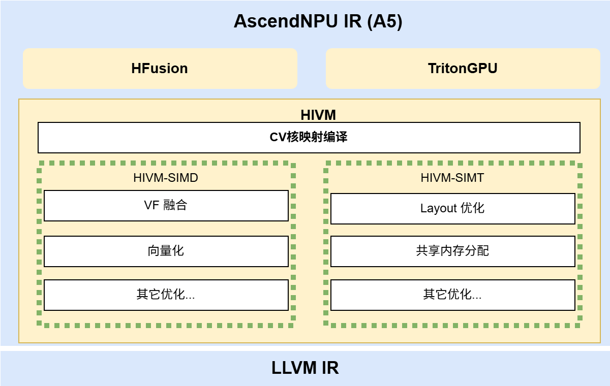

# 架构设计

## 目标定位

毕昇编译器`AscendNPU IR`是基于`MLIR`生态构建的昇腾硬件高层抽象表达，它会自下而上对昇腾硬件底层指令、核内资源、核间资源、`SOC`资源逐层进行抽象编译优化，多层抽象间分层解耦、开源开放，允许生态编程、三方框架权衡性能与易用性的需求灵活对接，为生态框架提供面向昇腾的统一编译接入层和硬件完备表达优化能力。


## 逻辑架构

`AscendNPU IR`中自研设计的方言有`HFusion`、`HIVM`、`HACC`、`Annotation`、`Scope`，其中`HFusion`方言负责硬件相对无关的优化，`HIVM`则负责精细化感知`NPU`硬件细节，将`High level`的编程语言转换成`NPU`的底层指令，`HACC`方言负责异构硬件抽象表达，`Annotation`和`Scope`则负责对于特定`Operand`或者`Operation`标记`compiler hint`信息。


### HFusion 方言

`HFusion`（`Hybrid Fusion`）方言是基于`MLIR`社区`Linalg`方言的扩展集，`HFusion`方言继承了`Linalg`方言的所有`operations`并且自行扩展了`Linalg`社区还未支持的`operations`，要注意`HFusion`方言处理的`operations`均是`named operations`，这样可以最大化保留高层语义方便编译器处理。`HFusion`方言主要包括转换层、预处理、融合处理三层能力：

1. **转换层**：`HFusion`方言是生态对接关键的一层，当前支持与`Arith`、`Math`、`Torch`等方言关键`Operations`的`Conversion`对接，后续会逐步完善补齐生态对接能力。

2. **预处理**：硬件细节相对无关优化层，支持`Tensor`表达式化简、`BF16`/`Bool`数据类型合法化、复杂`OP`组合实现等常见`Device`函数优化。

3. **融合处理**：能够自动融合生成`Device Kernel`算子及`Host Tiling`函数。

### HIVM 方言

`HIVM`（`Hybrid ISA Virtual Machine`）：面向昇腾硬件对计算、搬运、同步等操作进行抽象，提供`Tile`级`Operation`支持任意维度、大小的`Tensor`或者`Memref`操作类型，屏蔽昇腾硬件底层指令参数。`HIVM`层编译优化主要分为以下三层：

1. **CV核映射编译**：感知`NPU CV`核分离硬件架构自动对`Mix Kernel`（既包括`cube`操作又包括`vector`操作的核函数）进行`CV`融合编译优化，通过分析`cube`和`vector`操作间的数据依赖关系自动插入`store`和`load`来进行`CV`核数据交互，计算中间交互所需的`workspace global memory`空间大小并生成`Host`侧推导大小的函数，同时对有`CV`数据依赖处插入核间同步保证依赖顺序，最后自动拆分`MixKernel`为单独的`AIC`核函数和`AIV`核函数，从而实现`CV`融合编译功能。在性能优化上，通过`CVPipeline pass`自动实现调整`Cube`代码与`Vector`代码顺序保证`CV`核流水并行，通过`AutoSubTiling`自动实现`CV`配比`1:2`切分特性。

2. **核内片上内存映射**：感知`NPU`核内片上内存结构，编译优化自动实现片上内存空间推导、片上内存数据格式推导、片上访存自动对齐、`OP`临时空间申请以及片上内存地址分配。

3. **核内处理单元映射**：感知`NPU`核内多级流水处理单元，自动插入流水同步操作保证不同流水线有序执行同时并行流水优化；感知`NPU`指令细节自动完成基于策略的指令自动映射，使能`NPU SIMD`高效指令。

### A5 芯片上的特性与 AscendNPU IR 的支持优化

`A5`芯片继承了`310B`芯片的`RegBase`（`Register-based`）的编程模型，硬件上相比`A2`和`A3`芯片`Memory-based`编程模型增加了寄存器层；在`Cube`和`Vector`核之间增加了数据通路，为`CV`融合提供更多优化空间；增加了`Warp Scheduler`等组件引入`SIMT`能力；增加`ND-DMA`等一些新的硬件指令。

`AscendNPU IR`在`HIVM`方言中对新的硬件特性提供了支持，包括`Arith`和`Vector`方言支持计算与规约类`OP`。对于纯`SIMD`编译增加了`VF`融合、向量化、掩码优化和`Combine`优化。在`A5`上新增`SIMT`编译支持，将社区的`TritonGPU`方言对接至`HIVM`，构建昇腾亲和的`Layout`优化、共享内存分配、核心指令映射优化的算法。`AscendNPU IR`在`A5`上除了支持纯`SIMD`模式和纯`SIMT`以外，还支持`SIMD/SIMT`混合编译。



## 代码架构

`AscendNPU IR`是基于`MLIR`生态构建的，`MLIR`原生社区代码是作为第三方引入，代码结构如下所示，`bishengir`（即`AscendNPU IR`）目录下是`AscendNPU IR`相关实现，`build-tools`目录下是`AscendNPU IR`构建所需脚本。`AscendNPU IR`对于`MLIR`原生社区的增强会优先在`include/bishengir/Dialect`独立目录下创建对应方言目录，通过独立目录新增文件扩展能力来避免对社区侵入式修改；对于无法隔离的修改，已直接提交到`third-party`下对应的 Ascend 维护分支中（例如 `llvm-project` 对应分支为 `Ascend/AscendNPU-IR/llvmorg-19.1.7`、`torch-mlir` 对应分支为 `Ascend/AscendNPU-IR/main-20250716`），每个修改均有单独`commit`信息，便于后续回合`MLIR`社区。历史版本中通过 `build-tools/patches` 目录下的 patch 文件在构建时应用的方式已废弃。

```text
.
├── bishengir // AscendNPU IR 相关实现
├── build-tools // AscendNPU IR 构建脚本所在目录
│   └── build.sh
└── third-party
    ├── llvm-project // Ascend 维护分支：Ascend/AscendNPU-IR/llvmorg-19.1.7
    ├── shmem
    └── torch-mlir   // Ascend 维护分支：Ascend/AscendNPU-IR/main-20250716
```

`bishengir`目录结构和`mlir`目录结构保持一致：`include`下存放声明文件，包括`C++`头文件（`.h`、`.hpp`）和`TableGen`定义文件（`.td`），构建目录`build/include`中包含`TableGen`自动生成的文件（`.h.inc`、`.cpp.inc`）；`lib`目录存放实现代码（`.cpp`），其目录结构与`include`基本保持一致。

```text
.
├── bishengir // AscendNPU IR 相关实现
│   ├── include
│   │   └── bishengir
│   │       ├── Conversion
│   │       └── Dialect
│   │           ├── 社区方言 // 对于社区方言的扩展增强
│   │           └── 自研方言 // 自定义的方言
├── lib
└── tools
    ├── bishengir-compile // AscendNPU IR 编译器命令行驱动程序
    └── bishengir-opt
```

`IR`中主要由`Conversion`、`Dialect`、`tools`三部分组成，其中`Conversion`承载不同方言间转换的能力，`Dialect`下是不同方言的定义和实现，`tools`目录下定义编译工具链。
`Conversion`中既包括三方生态对接转换（如`TorchToHFusion`）也包括`AscendNPU IR`内部方言间转换（如`HFusionToHIVM`）；`Dialect`下既包括自研方言也包括社区方言；`tools`中`bishengir-compile`是`AscendNPU IR`编译器的命令行驱动程序。

## 编译流程

`AscendNPU IR`对应工具链是`bishengir-compile`，会负责把高抽象层级的`Tile`级`OP`编译成感知`NPU`硬件架构的`low level op`，该工具链输入和输出均是`MLIR`。`hivmc`工具会负责把`low level`的`MLIR`转成`LLVM IR`并基于`LLVM IR`进行底层指令编译优化，最终生成算子二进制。

